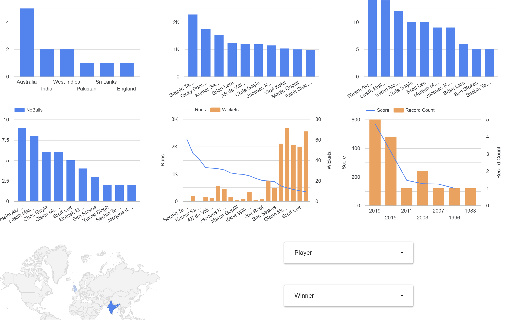

Cricket World Cup Analytics Dashboard
----------------------------------------

This project visualizes Cricket World Cup statistics using **Looker Studio**.
It contains insights such as tournament winners, best players, most runs,
top bowling figures, venues performance and more!

Live Dashboard
-------------------
[Click here to view](https://lookerstudio.google.com/reporting/b3ef193f-cc40-4792-b826-ddbf7326d02d)

Features / Charts Included
----------------------------

| Dataset | Visualizations |
|--------|----------------|
| World Cup Results | Winner count bar chart |
| Player Stats | Runs vs Wickets combo chart |
| Top Innings | Score trend chart |
| Venue Data | Geo map for venues & India wins |

Datasets Used
--------------

All files are stored in `Cricket WorldCup Dashboard Data` folder.

- WorldCupResults.csv  
- PlayerStats.csv  
- TopInnings.csv  
- VenueData.csv  

Dashboard Preview
------------------

Tools Used
------------
- Looker Studio
- Google Sheets / CSV
- GitHub

How to Use
-------------
1. Open the dashboard link
2. Use filters (Player, Winner) to explore insights
3. Modify dataset and charts from Looker Studio if needed

